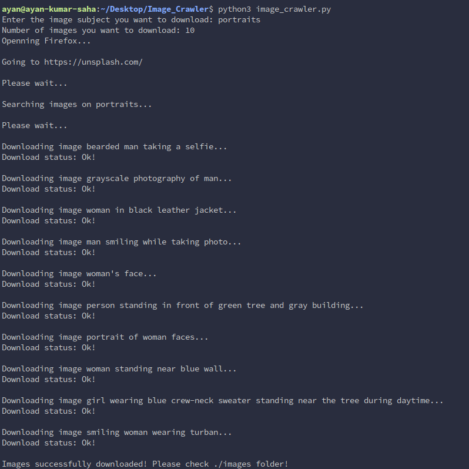

# Image Crawler for Unsplash.com

A web image scraper that scrapes images from unsplash.com. All images downloaded from Unsplash are free for commercial and noncommercial use.

## Table of Content

* [Prerequisites](#prerequisites)

* [Getting started](#getting-started)

* [Environment setup](#environment-setup)

* [For Google Chrome users](#for-google-chrome-users)

* [Run Image Crawler](#run-image-crawler)

* [Usage](#author)

* [Output](#output)

* [Author](#author)

* [License](#license)

## Prerequisites

* **Python 3** and **pip** - **python 3** and Python package installer **pip** needs to be installed in the system. Check if you have python3 and pip already installed in your machine using,

```
  ~$ python3 --version
  Python 3.6.9

  ~$ pip3 --version
  pip 9.0.1 from /usr/lib/python3/dist-packages (python 3.6)
```

* A **web browser** - A web browser (that supports headless mode) is required to run the script properly. My recommendation is **Mozila Firefox** or **Google Chrome**.

  However, Chrome users, check [here](#for-google-chrome-users) before running the script.

  At the time of this documentation, headless mode is not supported by any other regular browser.

* A **web driver** for the **web browser** - A web driver is required according to the chosen browser. **Firefox**, for example, requires **geckodriver**, which needs to be installed before script can be run. Download appropriate web driver for your browser from the following table.

    |Browser| Driver Link|
    |--------|----------------|
    |Firefox|[Download](https://github.com/mozilla/geckodriver/releases)|
    |Chrome|[Download](https://sites.google.com/a/chromium.org/chromedriver/downloads)|

    After download, 
    
    `Linux/macOS` users, make sure to place it in your PATH, e.g., place it in `/usr/bin` or `/usr/local/bin`.

    `Windows` users, add it in the **system environment variables**.

* A **stable internet connection** is must.

## Getting started

Clone the repository to your local machine using,
 
```
~$ git clone https://github.com/Ayan-Kumar-Saha/image-crawler.git
```

## Environment setup

To install all dependencies at once, move into project directory and run,


### Linux/macOS 

```
~$ pip3 install -r dependencies.txt
```

### Windows
```
~$ pip install -r dependencies.txt
```

## For Google Chrome users

Chrome users, change these lines before running the script,

* Line 5 from
  ```
    from selenium.webdriver.firefox.options import Options
  ```
  to
  ```
    from selenium.webdriver.chrome.options import Options
  ```
* Line 26 from
  ```  
    browser = webdriver.Firefox(options = options)
  ```
  to
  ```
    browser = webdriver.Chrome(options = options)
  ```

## Run Image Crawler

Run the crawler using, 

### Linux and macOS

```
~$ python3 image_crawler.py
```

### Windows

```
~$ python image_crawler.py
```

## Usage

Once the script starts, You need to give type or name of the image you want to download. For example, portraits

```
~$ Enter the image subject you want to download: portraits
```

Then enter the number of images you want to download.

```
~$ Number of images you want to download: 10
```

After that the script will download images for you. Once completed, an images folder should be created in the project directory, which will contain the downloaded images.

## Output

Output should be somewhat similar as following

   ### Terminal

   

   ### Images folder:

   

## Build With

* [Selenium](https://selenium-python.readthedocs.io/) - An automation tool 
* [Requests](https://requests.readthedocs.io/en/master/) - HTTP library for Python

## Author

**Ayan Kumar Saha**
* [GitHub](https://github.com/Ayan-Kumar-Saha)
* [LinkedIn](https://www.linkedin.com/in/ayankumarsaha/)

## License

Copyright © 2020 [Ayan Kumar Saha](https://github.com/Ayan-Kumar-Saha) Released under the [MIT](https://choosealicense.com/licenses/mit/) license.
