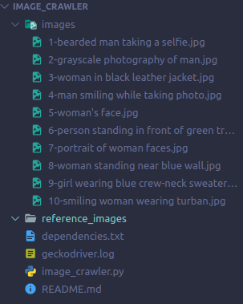

# Image Crawler for Unsplash.com

This is a web image scrapper that scraps images from unsplash.com.

## Prerequisites

* **Mozila Firefox** web browser - This script is written for firefox. To use this script for other browsers, check [here](#Note). To download firefox, click [here](https://www.mozilla.org/en-US/firefox/new/).

* **Driver** for the web browser - A web driver is required according to the chosen browser. **Firefox**, for example, requires **geckodriver**, which needs to be installed before script can be run. Make sure it’s in your PATH, e.g., place it in `/usr/bin` or `/usr/local/bin`.

    |Browser| Driver Link|
    |--------|----------------|
    |Chrome|[Download](https://sites.google.com/a/chromium.org/chromedriver/downloads)|
    |Edge|[Download](https://developer.microsoft.com/en-us/microsoft-edge/tools/webdriver/)|
    |Firefox|[Download](https://github.com/mozilla/geckodriver/releases)|
    |Safari|[Download](https://webkit.org/blog/6900/webdriver-support-in-safari-10/)|

* A **stable internet connection** is must.

## Note

In order to run this script for browsers other than Firefox, change the line
```
browser =  webbrowser.Firefox()
```
accoring to your browser.

For Google Chrome, `browser =  webbrowser.Chrome()`

For Microsoft Edge, `browser =  webbrowser.Edge()`

For Opera, `browser =  webbrowser.Opera()`

For Safari, `browser =  webbrowser.Safari()`


## Installation

 Clone the repository to your local machine using,
```
$ git clone https://github.com/Ayan-Kumar-Saha/image-crawler.git
```
Move into the project folder. Then run the following command to install all dependencies.

```
$ pip3 install -r dependencies.txt
```

Now run the script using,

```
$ python3 image_crawler.py
```
## Usage

Once the script starts, You need to give type or name of the image you want to download. For example, portraits

```
$ Enter the image subject you want to download: portraits
```

Then enter the number of images you want to download.

```
$ Number of images you want to download: 10
```

After that the script will download images for you. Once completed, an images folder should be created in the project directory, which will contain the download images.

### Output


### Images folder:



## Build With

* [Selenium](https://selenium-python.readthedocs.io/) - An automation tool 
* [Requests](https://requests.readthedocs.io/en/master/) - HTTP library for Python

## Author

**Ayan Kumar Saha**

## License
[MIT](https://choosealicense.com/licenses/mit/)